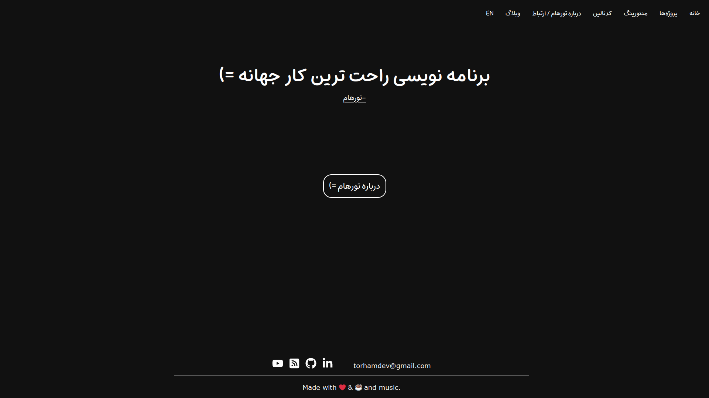

# Torham-personal-website
A website powered by **Django** that is used as a personal website. 🐍🍃

## Sections of the website
1. Home page 🏠
2. Project page 💻
3. About/contact page 👨‍💻
4. Mentoring app 👨‍🏫
5. Podcast app 🎙
6. Weblog 🌈

## Home Page 🏠
The home page of this website has a large text that you can change from the admin panel.

## Project page 💻
You can list your projects on this page. This list can be updated and changed in the admin panel.

## About/contact page 👨‍💻
On this page, you can put a photo and an explanatory text about yourself. You can also put the link of your social networks on this page.

## Mentoring App 👨‍🏫
In this section, different people can fill a form and request mentoring. And these requests will be registered in the admin panel.

## Podcast app 🎙
In this section, you can upload your podcasts and share them with others.

## Weblog 🌈
link to your weblog =)

## ScreenShot

# License
